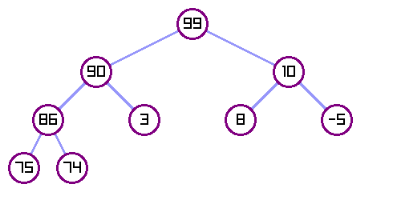

## TreeIt!

A simple program that render a binary tree and export it as a PNG image.



### Features

- Customizable colors and sizes
- Export to PNG with optional transparent background

### Build

```bash
mkdir build && cd build
cmake ..
make
```

### Usage

```bash
./tree-it --list=5,3,8,1,4,7,9
```

Use `--help` for all available options.

### Example

```bash
./tree-it --node-color 122 226 207 --transparent-background --list=99,90,10,86,3,8,-5,75,74
```
